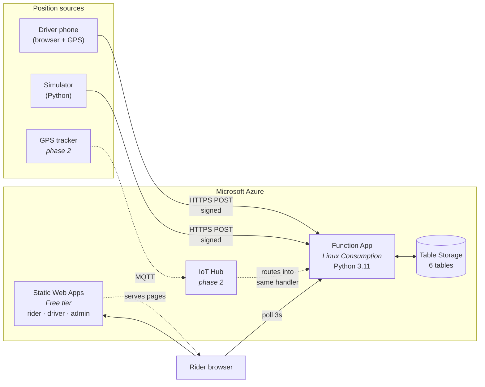
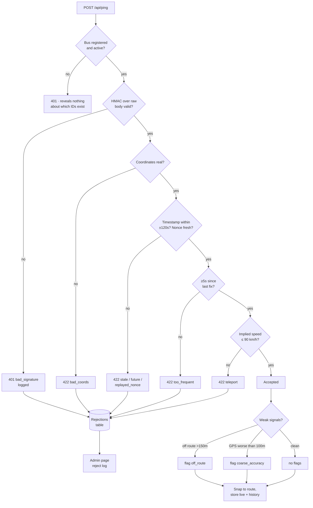
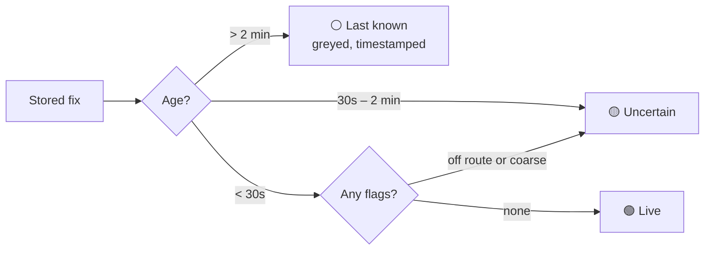
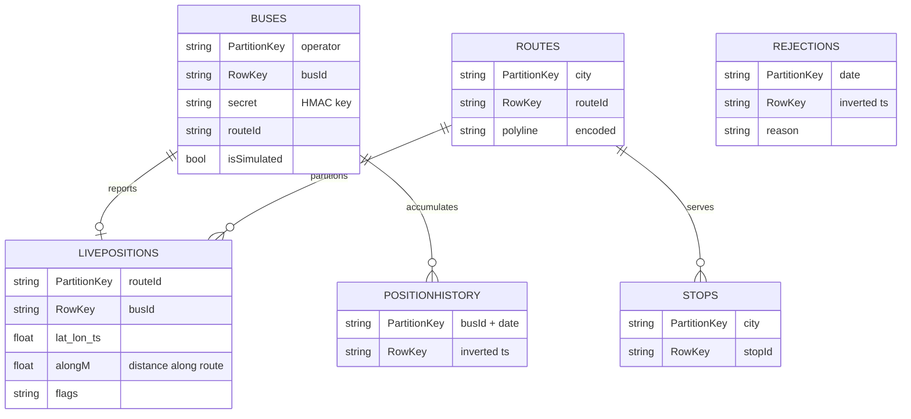
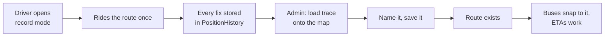

# Architecture

Companion to the [README](../README.md) and the [threat model](threat-model.md).
This document explains *why* the system is shaped the way it is, which is the
part that does not survive being read off the code.

---

## 1. The framing

India tracks trains well and buses barely at all, and the reason is not
technical.

| | Trains | Buses |
|---|---|---|
| Vehicles | ~7,000 | ~2,000,000 |
| Operators | One | Hundreds, unconnected |
| Position data | A by-product of centralised signalling | Does not exist |
| Incentive to publish | Already published | None |

A train's location exists as data whether or not anyone builds an app. A bus's
location **does not exist until somebody creates it.** Everything below follows
from that single fact.

So "build a bus tracker" decomposes into three problems, and the system is
organised around them:

1. **Ingest** — get a position out of a bus nobody is paid to instrument.
2. **Trust** — know the report came from the bus it claims to be.
3. **Meaning** — turn a coordinate into "your bus arrives in 6 minutes."

---

## 2. System topology

The shape that matters: **one ingest endpoint**. Phone, simulator, and any
future hardware all converge on `/api/ping`, where identity and plausibility are
checked before anything is written. Adding IoT Hub later means routing its
messages into that existing handler, not building a second pipeline with a
second set of rules.

---

## 3. What happens to one position report

**The distinction that carries the design:** rejection versus degradation.

- **Rejected** reports are impossible or hostile. They leave no trace on the map.
- **Degraded** reports are plausible but weak. They are **stored and shown with
  reduced confidence**, never discarded.

Off-route is deliberately a degradation, not a rejection. Real buses take
diversions for roadworks, festivals, and flooding. Throwing those reports away
would make the system lie by omission — the bus would simply vanish, which is
worse than showing it with a caveat.

---

## 4. Confidence, and the rule that matters most

What a rider sees is computed at **read** time, not write time, because
freshness changes while data sits still.

**Freshness dominates everything else.** A perfect, on-route, high-accuracy fix
from four minutes ago is still only a *last known position*. Drawing it as live
is the single behaviour that destroys trust in bus tracking apps in practice —
users learn the dot lies, and then stop believing any of it.

This is enforced in code and locked down by
`test_a_perfect_but_old_fix_is_never_shown_as_live`.

The rider map extends the same principle to its own failures. It distinguishes
"no bus is approaching this stop" from "no buses are being tracked on these
routes", and when it cannot reach the server it says *"Offline for 40s"* rather
than leaving stale dots looking current.

---

## 5. Data model

Partition keys were chosen so the query the app actually makes is the cheap one:

- `LivePositions` partitions by **routeId**, so "every bus on route X" — the
  rider map's main query — is a single-partition read.
- `Routes` and `Stops` partition by **city**, which is what lets three hand-drawn
  Nagercoil routes and 3,934 imported Chennai routes coexist without either one
  slowing the other down.
- History and rejections use an **inverted millisecond timestamp** as the row
  key, so Table Storage's natural ascending order returns newest-first — which
  is the only order anything asks for. The millisecond resolution plus a random
  suffix matters: at second resolution, two buses rejected in the same second
  collided and the second write failed with a 409.

---

## 6. Where route data comes from

Nagercoil has no GTFS feed, no open route list, and no stop database. There is
nothing accurate to import. So the system **bootstraps its own**:

That is the answer to *"how would this ever work in a town with no data?"* — the
system creates its route data by being used.

The other end of the spectrum is proven by the GTFS importer. Chennai MTC's
public feed goes in — 4,614 routes, 47,056 trips, 1.36 million `stop_times`
rows — and 3,934 routes come out into the same tables, with **no downstream code
change**. The feed ships no `shapes.txt` (common for Indian GTFS), so geometry
falls back to the ordered stops of a representative trip.

Hand-drawn, recorded, and imported routes are indistinguishable to everything
that reads them.

---

## 7. Decision log

The reasoning, including what was rejected. This is the part worth defending in
a viva.

| Decision | Chosen | Rejected | Why |
|---|---|---|---|
| **Cloud** | Azure | AWS | Student credit with no card attached: it hard-stops rather than billing. AWS was preferred technically for IoT Core but carried real overspend risk. |
| **Database** | Table Storage | Cosmos DB | Cosmos free tier is one-per-subscription, opt-in-at-creation, and has a history of failing to provision on student subscriptions. Table Storage's key model is an exact fit, and Cosmos' Table API is a connection-string swap if it is ever outgrown. |
| **Realtime** | HTTP polling (3s) | SignalR | SignalR's free tier caps at **20 concurrent connections**. A classroom of 30 would break it mid-demo. Polling has no cap and costs nothing extra. |
| **Hardware ingest** | Deferred | IoT Hub now | Free tier allows 8,000 messages/day at 0.5 KB. One bus pinging every 10s uses **8,640 on its own**. Deferring is a costed decision, not an omission — and the pipeline was built so adding it needs no rework. |
| **Compute** | Functions on Consumption | A VM | A rented VM running a web server is not meaningfully a cloud architecture. Consumption scales to zero, which matters when the credit is finite. |
| **Basemap** | OpenStreetMap raster | Azure Maps | No API key, no billing surface. Azure Maps is the documented swap for anything real, since OSM's tile policy discourages heavy use. |
| **Auth for ingest** | Per-bus HMAC | Function keys | A shared function key would end up pasted into every driver's browser, and could not be revoked for one bus. |
| **Signature covers** | Raw request body | Canonical string | Removes the entire class of bugs where browser and server disagree about float formatting. |
| **Credential transport** | URL fragment | Query string | Fragments are never sent to the server and never appear in server logs. |
| **Route data** | Record mode | OSM import | OSM's bus-route coverage for Nagercoil is negligible. Recording produces accurate data *and* is the more honest answer to the underlying problem. |
| **Off-route reports** | Flag | Reject | Real buses divert. Rejecting would make the map lie by omission. |
| **ETA output** | A range | A single number | A tracker that says "7 minutes" and is wrong by four is worse than one that says "6–11" and is right. The range teaches the rider how much to trust it. |

---

## 8. Known limits

Stated because a system that hides these is less trustworthy than one that
names them.

- **Browser GPS stops when the screen locks** or the driver switches apps, on
  both iOS and Android. The page requests a screen wake lock, which helps and
  does not fix it. This is the concrete technical argument for a dedicated
  tracker — not an oversight.
- **A driver who lies about position while staying on their route is not
  detectable.** The only real answer is multi-reporter consensus, which is
  designed and not built.
- **Seeded Nagercoil geometry is approximate** and visibly cuts across country
  rather than following roads. Replace it with recorded traces before claiming
  accuracy.
- **One admin key protects every bus secret.** No rotation, no per-user roles.
- **Driver location history is retained indefinitely** with no policy and no
  consent flow. That is an ethical gap, not a technical one, and it is real.

---

## 9. Phase 2

In the order that would actually add the most value:

1. **Record real Nagercoil routes** — replaces approximate geometry with
   surveyed data, and is a prerequisite for trusting any ETA.
2. **IoT Hub + a GPS module** — removes the wake-lock limitation entirely and
   makes the tracker independent of a driver's phone and goodwill.
3. **Learned ETAs** — segment travel times by time of day from
   `PositionHistory`, which the system is already accumulating.
4. **Multi-reporter consensus** — the only genuine defence against a driver
   reporting a false position.
5. **AIS-140 / VLTD ingestion** — Indian public service vehicles are already
   legally required to carry GPS units. Long term, ingesting those regulated
   feeds beats relying on phones, and solves coverage at the same time.
